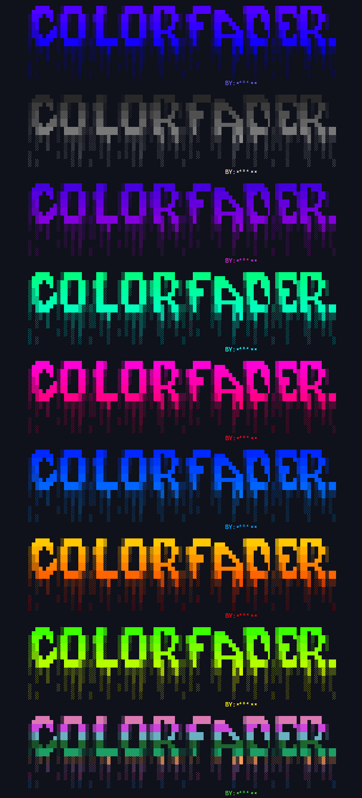

<div align="center">


**Beauty-Logo** is a simple script for applying a colorful fading effect.



</div>

## Usage Example

```python
from beautylogo import ColorFader, ColorMode

text = """
 ▄████▄  ▒█████    ██▓    ▒█████   ██▀███     █████ ▄▄▄     ▓█████▄  ▓█████ ██▀███     
▒██▀ ▀█ ▒██▒  ██▒ ▓██▒   ▒██▒  ██▒▓██ ▒ ██▒ ▓██    ▒████▄   ▒██▀ ██▌ ▓█   ▀▓██ ▒ ██▒   
▒▓█    ▄▒██░  ██▒ ▒██░   ▒██░  ██▒▓██ ░▄█ ▒ ▒████  ▒██  ▀█▄ ░██   █▌ ▒███  ▓██ ░▄█ ▒   
▒▓▓▄ ▄██▒██   ██░ ▒██░   ▒██   ██░▒██▀▀█▄   ░▓█▒   ░██▄▄▄▄██░▓█▄   ▌ ▒▓█  ▄▒██▀▀█▄     
▒ ▓███▀ ░ ████▓▒░▒░██████░ ████▓▒░░██▓ ▒██▒▒░▒█░   ▒▓█   ▓██░▒████▓ ▒░▒████░██▓ ▒██▒██ 
░ ░▒ ▒  ░ ▒░▒░▒░ ░░ ▒░▓  ░ ▒░▒░▒░ ░ ▒▓ ░▒▓░░ ▒ ░   ░▒▒   ▓▒█ ▒▒▓  ▒ ░░░ ▒░ ░ ▒▓ ░▒▓░▒▒ 
  ░  ▒    ░ ▒ ▒░ ░░ ░ ▒    ░ ▒ ▒░   ░▒ ░ ▒ ░ ░     ░ ░   ▒▒  ░ ▒  ▒ ░ ░ ░    ░▒ ░ ▒ ░  
░       ░ ░ ░ ▒     ░ ░  ░ ░ ░ ▒    ░░   ░   ░ ░     ░   ▒   ░ ░  ░     ░    ░░   ░ ░  
░ ░         ░ ░  ░    ░      ░ ░     ░     ░             ░     ░    ░   ░     ░      ░ 
                                BY:ˣ⁴⁰⁴ˣˣ
"""

fader = ColorFader(text)

print(fader.apply_fade(ColorMode.BRIGHT_BLUE))
print(fader.apply_fade(ColorMode.BLACK_WHITE))
print(fader.apply_fade(ColorMode.PURPLE_BLUE))
print(fader.apply_fade(ColorMode.LIGHT_GREEN))
print(fader.apply_fade(ColorMode.PINK_RED))
print(fader.apply_fade(ColorMode.LIGHT_BLUE))
print(fader.apply_fade(ColorMode.YELLOW_ORANGE))
print(fader.apply_fade(ColorMode.BRIGHT_GREEN))
print(fader.apply_fade(ColorMode.RANDOM))
```
